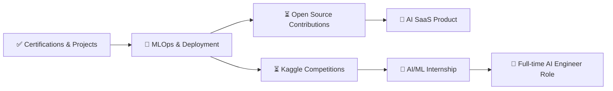

<div align="center">

<!-- Animated Header Banner -->


<!-- Typing SVG -->
<a href="https://github.com/sahilgaund03">
  
</a>

<br/><br/>

<!-- Core Badges -->
[](https://linkedin.com/in/sahilgaund03)
[](mailto:sahilgaund42@gmail.com)
[](https://www.google.com/maps/place/Thane)
[](#)

<br/>

<!-- Stats Badges -->


</div>

---

## 📋 Table of Contents

<details>
<summary>Click to expand navigation</summary>

- [👤 About Me](#-about-me)
- [🎯 What This Repository Is](#-what-this-repository-is)
- [🛠️ Tech Stack](#️-tech-stack)
- [🚀 Featured Projects](#-featured-projects)
- [🏅 Certifications & Credentials](#-certifications--credentials)
- [🎓 IBM Digital Badges](#-ibm-digital-badges)
- [💼 Internship Experience](#-internship-experience)
- [🗺️ AI Engineer Roadmap](#️-ai-engineer-roadmap)
- [📊 Analytics Dashboard Showcase](#-analytics-dashboard-showcase)
- [🎓 Education](#-education)
- [🔮 Future Roadmap](#-future-roadmap)
- [📫 Connect With Me](#-connect-with-me)

</details>

---

## 👤 About Me

<table>
<tr>
<td width="55%">

### Sahil Gaund — AI & ML Engineering Student

> *"Passionate about responsible AI design, cloud-based solutions, and turning data into decisions."*

I'm an **AI & Machine Learning Engineering Student** based in **Thane, Maharashtra**, actively building expertise at the intersection of supervised learning, generative AI, and data science. My journey spans hands-on projects, industry-recognized certifications from **Google Cloud**, **IBM**, **Databricks**, **AWS**, and **NVIDIA**, and real-world internship simulations.

Currently enrolled in **B.Sc. Information Technology** at **Dr. Homi Bhabha State University, Mumbai**, I complement academic learning with aggressive self-directed certification paths and practical project work.

#### 🎯 What I'm focused on:
- 🤖 Building & deploying ML models (classification, regression, NLP)
- ☁️ Cloud-based AI solutions on GCP, AWS, Databricks
- 📊 Exploratory data analysis & business storytelling
- 🧠 Generative AI, LLMs, RAG pipelines & prompt engineering
- 🚢 MLOps, FastAPI, Docker, and model deployment

</td>
<td width="45%" align="center">

```
📁 achivement/
├── 🤖 ALL Projects/           (12 projects)
│   ├── AI Spam Detection System
│   ├── Bank Customer Churn Prediction
│   ├── Customer Analytics Dashboard
│   ├── Care Transition Analytics (EDA)
│   ├── Diwali Sales Analysis
│   ├── Netflix Data Analysis
│   ├── Google Search Analysis
│   ├── SMS Spam Detection
│   ├── Email Spam Classifier
│   ├── ML Algorithms Implementation
│   ├── Python Data Analysis
│   └── Website Data Analysis
├── 📜 CERTIFICATE/            (20 certs)
├── 🏅 IBM Badges/             (5 badges)
├── 💼 Internship/             (2 offers)
├── 🌐 Virtual Internship/     (3 sims)
├── 🗺️ AI Engineer Roadmap/
└── 📄 RESUME/
```

</td>
</tr>
</table>

---

## 🎯 What This Repository Is

This repository is a **living portfolio of academic and professional achievements** — a curated collection that documents my growth as an AI/ML engineer. It serves as:

| Purpose | Description |
|:---|:---|
| 📂 **Credential Vault** | All certifications, IBM badges, and internship records in one verifiable place |
| 🧪 **Project Showcase** | Real data science and ML projects with end-to-end pipelines |
| 🗺️ **Learning Roadmap** | A structured 12-month AI Engineering roadmap being actively followed |
| 📊 **Portfolio Hub** | Interactive dashboards, analysis reports, and deployed mini-apps |
| 🎯 **Career Documentation** | Resume, offer letters, and job simulation completions |

> **Core Problem Solved:** AI/ML talent is often invisible without a central, structured credential portfolio. This repository makes every achievement discoverable, verifiable, and accessible to recruiters, collaborators, and the technical community.

---

## 🛠️ Tech Stack

<div align="center">

### Languages & Core Tools


### Machine Learning & AI


### Data Science & Analytics


### Cloud Platforms


### Dev Tools & Deployment


### Analytics & BI


</div>

---

## 🚀 Featured Projects

<details open>
<summary><b>🤖 AI Spam Detection System</b></summary>

> **NLP-powered multi-model spam classifier with Streamlit deployment**

| Attribute | Detail |
|:---|:---|
| 🎯 **Goal** | Classify SMS/email messages as Spam or Ham with high accuracy |
| 🧠 **Algorithms** | Naive Bayes, Logistic Regression, SVM, Ensemble methods |
| 🛠️ **Stack** | Python · Scikit-learn · NLTK · Streamlit · Pandas |
| 📊 **Output** | Interactive web app for real-time spam classification |
| 📄 **Deliverables** | Full analysis report + live Streamlit deployment |

**Key Highlights:**
- ✅ Text preprocessing pipeline: tokenization, stemming, stopword removal
- ✅ TF-IDF feature engineering for message vectorization
- ✅ Multi-model comparison with performance benchmarking
- ✅ Production-ready Streamlit web interface ("Spam or Ham" app)

</details>

<details>
<summary><b>🏦 Bank Customer Churn Prediction & Analytics Dashboard</b></summary>

> **End-to-end churn prediction model with interactive business dashboard**

| Attribute | Detail |
|:---|:---|
| 🎯 **Goal** | Predict customer churn to improve retention strategies |
| 🧠 **Algorithms** | Logistic Regression, Random Forest, XGBoost |
| 🛠️ **Stack** | Python · Scikit-learn · Pandas · Matplotlib · Seaborn |
| 📊 **Output** | Churn probability scores + actionable business insights |

**Key Highlights:**
- ✅ Feature engineering on 10K+ customer records
- ✅ Confusion matrix, ROC-AUC, precision-recall analysis
- ✅ Business-facing analytics dashboard (HTML + Chart.js)
- ✅ Model exported for production inference

</details>

<details>
<summary><b>📊 Customer Analytics Dashboard (Interactive HTML)</b></summary>

> **Real-time, filterable customer intelligence dashboard built in pure HTML + Chart.js**

| Attribute | Detail |
|:---|:---|
| 🎯 **Goal** | Visual analytics platform for customer behavior insights |
| 🛠️ **Stack** | HTML5 · CSS3 · JavaScript · Chart.js 4.4.1 |
| 📊 **Charts** | Bar, Pie, Doughnut, Stacked, Histogram charts |
| 🎛️ **Interactivity** | Live age-group filter, dynamic metric cards |

**Dashboard Sections:**
- 📌 **4 KPI Metric Cards** — Total Customers, Avg Purchase ($), Avg Rating, Avg Previous Purchases
- 📌 **Spend by Category** — Clothing, Footwear, Accessories, Outerwear breakdown
- 📌 **Spending Level Breakdown** — Low / Medium / High segmentation
- 📌 **Purchase Amount by Age Group** — Young Adult → Senior cohort analysis
- 📌 **Top Payment Methods** — Credit Card, Debit Card, PayPal, Cash, Venmo, Bank Transfer
- 📌 **Purchase Frequency Distribution** — Weekly to Annual frequency histogram
- 📌 **Season Popularity by Category** — Spring / Summer / Fall / Winter cross-analysis

</details>

<details>
<summary><b>🏥 CARE TRANSITION ANALYTICS — EDA</b></summary>

> **Healthcare data EDA with Streamlit deployment for care transition insights**

| Attribute | Detail |
|:---|:---|
| 🎯 **Goal** | Analyze patient care transition patterns to identify risk factors |
| 🛠️ **Stack** | Python · Pandas · Matplotlib · Seaborn · Streamlit |
| 📊 **Output** | EDA report + interactive Streamlit dashboard |
| 🏥 **Domain** | Healthcare analytics, patient risk profiling |

</details>

<details>
<summary><b>🪔 Diwali Sales Analysis</b></summary>

> **Retail sales analysis for India's largest festive season**

| Attribute | Detail |
|:---|:---|
| 🎯 **Goal** | Uncover purchasing patterns, top products, and customer segments during Diwali |
| 🛠️ **Stack** | Python · Pandas · Seaborn · Matplotlib · Jupyter |
| 📊 **Insights** | Region-wise sales, gender demographics, product category trends |

</details>

<details>
<summary><b>🎬 Netflix Data Analysis</b></summary>

> **Comprehensive EDA of Netflix's content catalog**

Analyzes Netflix's global catalog to surface content distribution, genre trends, country-wise production, release year patterns, and rating distributions across Movies and TV Shows.

</details>

<details>
<summary><b>📱 SMS Spam Detection · 📧 Email Spam Classifier · 🔍 Google Search Analysis · 🌐 Website Data Analysis · 🎢 Coaster Name EDA</b></summary>

A suite of additional ML and analytics projects covering:

| Project | Core Technique |
|:---|:---|
| **SMS Spam Detection** | NLP, Naive Bayes, CountVectorizer |
| **Email Spam Classifier** | TF-IDF, Logistic Regression |
| **Google Search Analysis** | Trend mining, keyword frequency analysis |
| **Website Data Analysis** | Traffic pattern analysis, user behavior insights |
| **Coaster Name EDA** | Feature exploration, NLP on theme park data |

</details>

---

## 🏅 Certifications & Credentials

<div align="center">

### 🌟 Google Cloud Certifications

</div>

| # | Certification | Issuer | Date | Code/ID |
|:--|:---|:---|:---|:---|
| 1 | 🤖 Introduction to Generative AI | Google Cloud Skills Boost | Jan 26, 2026 | `9764288` |
| 2 | 🖼️ Create Image Captioning Models | Google Cloud Skills Boost | Feb 5, 2026 | `9808274` |
| 3 | 🚀 Innovating with Google Cloud AI | Google Cloud | 2025 | — |
| 4 | 📊 Google Analytics Certification | Google | Feb 25, 2026 | `1753` · *Expires Feb 2027* |

<div align="center">

### 🔵 IBM & Databricks

</div>

| # | Certification | Issuer | Date | Code/ID |
|:--|:---|:---|:---|:---|
| 5 | 🗄️ Get Started with Databricks for ML | Databricks Academy | Feb 8, 2026 | `9818466` |
| 6 | ☁️ AWS Foundations: Machine Learning Basics | AWS / Skills Boost | Feb 8, 2026 | `9817476` |
| 7 | 📊 Applied Data Science with Python | IBM Skills Network | 2026 | Credly Verified |
| 8 | 🐍 Python 101 for Data Science | IBM | 2025 | — |
| 9 | 📈 Data Analysis with Python | IBM | 2025 | — |
| 10 | 📉 Data Visualization with Python | IBM | 2025 | — |
| 11 | 🤖 Machine Learning with Python | IBM | 2025 | — |

<div align="center">

### 🎓 AI & ML Fundamentals

</div>

| # | Certification | Issuer | Date |
|:--|:---|:---|:---|
| 12 | 🧠 AI and Machine Learning Full Course | — | 2025 |
| 13 | 🔤 Introduction to Large Language Models | Google Cloud | 2025 |
| 14 | 🔵 Introduction to Large Language Models | IBM | 2025 |
| 15 | 🤖 Fundamentals of ML and Artificial Intelligence | — | 2025 |
| 16 | 💬 Introduction to Prompt Engineering with GitHub Copilot | GitHub | 2025 |
| 17 | 🧪 Practicing Test Driven Development with Python | — | 2025 |
| 18 | 🔢 Machine Learning from Simplilearn | Simplilearn | 2025 |
| 19 | 🌱 HP LIFE: AI for Beginners | HP LIFE | 2025 |
| 20 | 🏆 YUVA AI for All | YUVA | 2025 |
| 21 | 💻 Learning C++ | LinkedIn Learning | 2025 |

---

## 🎓 IBM Digital Badges

<div align="center">

*All IBM badges verified via Credly — click to verify*

</div>

| Badge | Level | Verify |
|:---|:---|:---|
| 🐍 **Python for Data Science** | Foundational | [Credly](https://www.credly.com) |
| 📊 **Data Analysis Using Python** | Professional | [Credly](https://www.credly.com) |
| 📉 **Data Visualization Using Python** | Professional | [Credly](https://www.credly.com) |
| 🤖 **Machine Learning with Python** | Level 1 | [Credly · `7df2f429-05f7-4a86-abbf-540523441173`](https://www.credly.com/badges/7df2f429-05f7-4a86-abbf-540523441173) |
| 🔬 **Applied Data Science with Python** | Level 2 | [Credly](https://www.credly.com) |

---

## 💼 Internship Experience

### 🏢 Industry Internships

<table>
<tr>
<td width="50%">

**📊 Data Analysis Internship**

- 🏷️ Role: Data Analysis Intern
- 📅 Status: Offer Letter Received (Apr 2026)
- 📋 Focus: Data analysis, insights generation, reporting
- 📄 Proof: Offer Letter on file

</td>
<td width="50%">

**🤖 Machine Learning Internship**

- 🏷️ Role: ML Engineering Intern
- 📅 Status: Offer Letter Received (Apr 2026)
- 📋 Focus: ML model development & implementation
- 📄 Proof: Offer Letter on file

</td>
</tr>
</table>

### 🌐 Virtual Job Simulations (Forage)

| Simulation | Company | Completed | Key Tasks |
|:---|:---|:---|:---|
| 🔵 **Tata GenAI Powered Data Analytics** | Tata / Forage | Mar 31, 2026 | EDA & risk profiling · Predicting delinquency with AI · Business storytelling · AI-driven collections strategy |
| 📊 **Data Analytics Job Simulation** | Deloitte / Forage | Apr 1, 2026 | Data analysis · Forensic technology |
| 💻 **Introduction to Software Engineering** | Commonwealth Bank / Forage | 2025 | SDLC · Code quality · Version control · Engineering best practices |

---

## 🗺️ AI Engineer Roadmap

> **Personal 12-Month Structured Learning Path — Actively In Progress**

```
Month 01 ✅ Python Programming Fundamentals
         └── Syntax, loops, functions, NumPy, Pandas
             Project: Simple dataset analysis

Month 02 ✅ OOP & Data Handling
         └── Classes, Git/GitHub, Jupyter, Statistics basics
             Project: Dataset visualization

Month 03 ✅ Linear Algebra for AI
         └── Vectors, matrices, matrix multiplication

Month 04-05 ✅ Statistics & Probability for ML
         └── Distributions, hypothesis testing, Bayesian thinking

Month 06 ✅ Machine Learning Fundamentals
         └── Linear/Logistic Regression, KNN, Decision Trees,
             Random Forest, SVM, Scikit-learn
             Project: House price prediction

Month 07 ✅ Advanced Machine Learning
         └── XGBoost, LightGBM, Hyperparameter tuning
             Project: Fraud detection / Credit risk model

Month 08 🔄 Calculus & Optimization
         └── Derivatives, Gradient Descent, Loss functions
             Project: Implement gradient descent in Python

Month 09 🔄 Deep Learning
         └── Neural networks, CNNs, RNNs

Month 10 🔄 NLP & Transformer Models
         └── Tokenization, BERT, transformers

Month 11 🔄 Generative AI & LLMs
         └── Prompt engineering, RAG, Hugging Face,
             LangChain, LlamaIndex
             Project: AI chatbot for document Q&A

Month 12 ⏳ Deployment & MLOps
         └── FastAPI, Flask, Docker, Cloud deployment (AWS/GCP)
             Project: Deploy ML model as API
```

*Legend: ✅ Completed · 🔄 In Progress · ⏳ Upcoming*

---

## 📊 Analytics Dashboard Showcase

<div align="center">

### 🖥️ Customer Analytics Dashboard — Interactive Preview

</div>

The `Customer Analytics Dashboard` (`ALL Projects/Dashboard/Customer Dashboard.html`) is a **fully self-contained, zero-dependency interactive analytics tool** built with HTML5, CSS3, and Chart.js.

**Architecture Highlights:**

```
📁 Customer Dashboard.html (self-contained, ~10KB)
├── 🎛️ Age Group Filter  ──→  Dynamically updates ALL charts
├── 📊 Chart.js 4.4.1 CDN
├── 🔢 Synthetic data generator (seeded for reproducibility)
└── 5 Chart types:
    ├── Bar Charts      (spend by category, age purchase)
    ├── Doughnut Charts (spending levels, payment methods)
    ├── Pie Charts      (category breakdown)
    └── Stacked Bar     (season × category cross-analysis)
```

**Data Dimensions Covered:**
- 4 Product Categories: Clothing · Footwear · Accessories · Outerwear
- 4 Age Groups: Young Adult (18–29) · Adult (30–39) · Middle-aged (40–54) · Senior (55–70)
- 6 Payment Methods: Credit Card · Debit Card · PayPal · Cash · Venmo · Bank Transfer
- 4 Seasons: Spring · Summer · Fall · Winter
- 7 Purchase Frequencies: Weekly → Annually

---

## 🎓 Education

<table>
<tr>
<td>

### 🎓 Dr. Homi Bhabha State University (DHBSU)
**Bachelor of Science — Information Technology**
*Jan 2025 – Sep 2028 · Mumbai, India*

- 📚 Core: AI, Machine Learning, Software Engineering
- 📚 Data Structures, Python Programming, Database Systems
- 🎯 Focus: AI-first curriculum with industry alignment

</td>
<td>

### 🏛️ Sant Gadge Maharaj College (BES)
**Bachelor of Commerce — Information Technology**
*Aug 2024 – Apr 2025 · Mumbai, India*

- 📚 Foundation: IT fundamentals, Business applications
- 📚 Analytical thinking, Business IT systems
- 🎯 Bridge between commerce and technology

</td>
</tr>
</table>

---

## 🔮 Future Roadmap



**Near-term goals:**
- [ ] 🐳 Containerize and deploy a Streamlit app to GCP Cloud Run
- [ ] 📦 Publish first open-source Python ML utility package
- [ ] 🤗 Fine-tune a Hugging Face model for a domain-specific NLP task
- [ ] 📊 Complete a Kaggle competition in the top 25%
- [ ] 🔗 Build and deploy a full RAG pipeline with LangChain + LlamaIndex

---

## 📈 GitHub Stats

<div align="center">


</div>

---

## 📫 Connect With Me

<div align="center">

| Platform | Link |
|:---|:---|
| 💼 **LinkedIn** | [linkedin.com/in/sahilgaund03](https://linkedin.com/in/sahilgaund03) |
| 📧 **Email** | [sahilgaund42@gmail.com](mailto:sahilgaund42@gmail.com) |
| 🐙 **GitHub** | [github.com/sahilgaund03](https://github.com/sahilgaund03) |
| 📍 **Location** | Thane, Maharashtra, India |

<br/>

**💬 Open to:** AI/ML Internships · Data Science Roles · Collaborative Projects · Mentorship

<br/>

[](#)

</div>

---

## 📄 License & Usage

```
MIT License — Feel free to fork this portfolio structure for your own achievement repository.
All certificates, badges, and project outputs are the intellectual property of Sahil Gaund.
Verification codes embedded in certificate documents are authentic and verifiable.
```

---

<div align="center">


**⭐ If this portfolio inspires you, consider giving it a star!**

*Made with ❤️ by Sahil Gaund — Thane, Maharashtra, India*


</div>
