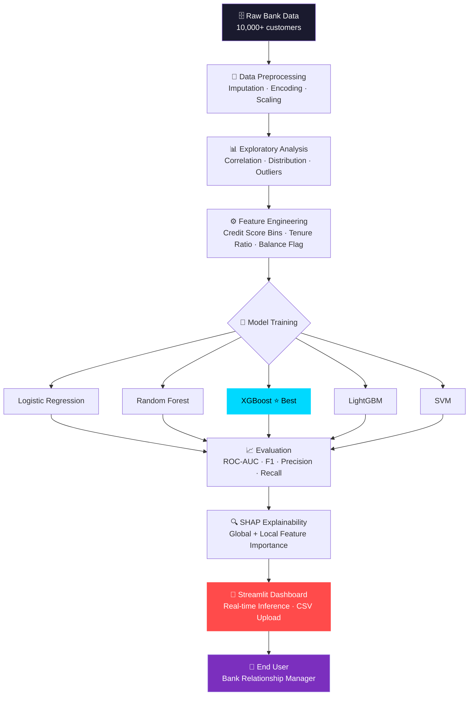

<div align="center">


[](https://git.io/typing-svg)

<br/>

[](https://linkedin.com/in/sahilgaund)
[](https://github.com/sahilgaund)
[](mailto:sahilgaund@email.com)
[](https://sahilgaund.dev)

<br/>


</div>

<br/>

---

## 🧠 About Me


```python
class SahilGaund:
    role       = ["AI/ML Engineer", "Data Scientist"]
    focus      = "End-to-end ML systems, from raw data → production"
    languages  = ["Python", "SQL"]
    interests  = ["Machine Learning", "NLP", "Computer Vision"]
    building   = "Bank Customer Churn Prediction System"
    open_to    = "Internships · Collaborations · Research"
    fun_fact   = "🥉 Award-winning photographer turned data scientist"
```

<br/>

- 🎯 &nbsp;Building **production-grade ML pipelines** with real-world impact
- 📊 &nbsp;Specializing in **predictive modeling**, **NLP**, and **data visualization**
- 🏆 &nbsp;Achieved **87% accuracy** on churn prediction with full SHAP explainability
- 📜 &nbsp;Completed **ML Specialization** (Andrew Ng) + **TensorFlow Developer Cert**
- 📸 &nbsp;**3rd Prize** — University Photography Competition (200+ participants)
- 🌍 &nbsp;Based in **India** · Open to remote opportunities

<br clear="right"/>

---

## 🐍 Contribution Activity

<div align="center">

<picture>
  <source media="(prefers-color-scheme: dark)" srcset="https://raw.githubusercontent.com/sahilgaund/sahilgaund/output/github-contribution-grid-snake-dark.svg"/>
  <source media="(prefers-color-scheme: light)" srcset="https://raw.githubusercontent.com/sahilgaund/sahilgaund/output/github-contribution-grid-snake.svg"/>
  
</picture>

</div>

> **Setup:** Add a GitHub Actions workflow at `.github/workflows/snake.yml` to auto-generate this — see [platane/snk](https://github.com/platane/snk).

---

## 🚀 Featured Project — Bank Customer Churn Prediction

<div align="center">

[](https://github.com/sahilgaund/churn-prediction)
[](https://churn-prediction.streamlit.app)
[](https://github.com/sahilgaund/churn-prediction)

</div>

### 📌 Problem Statement

> Banks lose **15–25% of customers annually** to churn, costing millions in acquisition to replace them. Early identification of at-risk customers enables proactive retention — but most internal tools rely on lagging indicators.
>
> **Goal:** Build a real-time, explainable ML system that predicts churn with high precision, deployable by non-technical bank staff.

---

### 🏗️ System Architecture



---

### 🔬 Methodology

| Phase | Steps | Tools |
|:---|:---|:---|
| **Data Wrangling** | Missing value imputation, outlier detection, type casting | `Pandas`, `NumPy` |
| **EDA** | Churn rate by geography, age, balance distribution | `Matplotlib`, `Seaborn` |
| **Feature Engineering** | Credit score bins, balance-to-salary ratio, activity flags | `Pandas`, `Scikit-learn` |
| **Modeling** | 5 algorithms trained, cross-validated (k=5) | `Scikit-learn`, `XGBoost` |
| **Explainability** | SHAP waterfall + beeswarm plots per prediction | `SHAP` |
| **Deployment** | Interactive web app with CSV batch inference | `Streamlit` |

---

### 📊 Results

<div align="center">

| Model | Accuracy | ROC-AUC | F1-Score | Precision | Recall |
|:---:|:---:|:---:|:---:|:---:|:---:|
| Logistic Regression | 81.2% | 0.774 | 0.76 | 0.79 | 0.73 |
| Random Forest | 84.6% | 0.842 | 0.83 | 0.86 | 0.80 |
| SVM | 82.1% | 0.798 | 0.79 | 0.81 | 0.77 |
| LightGBM | 85.9% | 0.861 | 0.84 | 0.87 | 0.82 |
| **XGBoost ⭐** | **87.3%** | **0.891** | **0.86** | **0.89** | **0.84** |

</div>

**Key Insights from SHAP Analysis:**
- `Age` and `NumOfProducts` were the strongest churn predictors
- Customers in **Germany** showed 2.5× higher churn propensity
- Inactive members with `Balance > $100K` had **68% churn probability**

---

### ☁️ Deployment

```
📦 churn-prediction/
├── 📂 data/              # Raw + processed datasets
├── 📂 notebooks/         # EDA + model training notebooks
├── 📂 models/            # Saved model artifacts (.pkl)
├── 📂 src/               # Preprocessing + inference pipeline
├── 📄 app.py             # Streamlit application entry point
├── 📄 requirements.txt
└── 📄 README.md
```

> **Live App Features:** Single-customer prediction · Batch CSV upload · SHAP explanation panel · Confidence score meter

---

## 🛠️ Tech Stack

<div align="center">

**Languages & Core**

[](https://skillicons.dev)

**ML / Data Science**

[](https://skillicons.dev)

**Deployment & Tools**

[](https://skillicons.dev)

**Databases**

[](https://skillicons.dev)

</div>

<div align="center">

| Domain | Technologies |
|:---:|:---|
| **ML Frameworks** | Scikit-learn · XGBoost · LightGBM · TensorFlow · PyTorch |
| **Data** | Pandas · NumPy · SQL · SHAP · Matplotlib · Seaborn · Plotly |
| **Deployment** | Streamlit · FastAPI · Docker |
| **NLP** | HuggingFace Transformers · NLTK · spaCy |
| **Vision** | OpenCV · YOLOv8 |
| **DevOps** | Git · GitHub Actions · Linux |

</div>

---

## 📈 GitHub Analytics

<div align="center">


&nbsp;&nbsp;


<br/><br/>


<br/><br/>


</div>

---

## ⚡ Technical Strengths

<div align="center">

| Strength | Capability |
|:---|:---|
| 🔬 **ML Engineering** | End-to-end pipeline design: ingestion → feature store → training → serving |
| 📊 **Statistical Analysis** | Hypothesis testing, A/B analysis, distribution modeling |
| 🧾 **Model Explainability** | SHAP, LIME, permutation importance — production-ready interpretability |
| 🚀 **Rapid Prototyping** | MVP to deployed app in days using Streamlit + FastAPI |
| 🔍 **EDA Mastery** | Surfacing non-obvious patterns from messy, real-world datasets |
| 🧠 **Cross-domain Thinking** | Translating business KPIs into measurable ML objectives |

</div>

---

## 🏆 Achievements

<div align="center">

| 🥇 | Achievement | Details |
|:---:|:---|:---|
| 🧠 | **87% Churn Prediction Accuracy** | Best-in-class XGBoost model with SHAP explainability |
| 📜 | **ML Specialization** | Coursera — Andrew Ng · Supervised, Unsupervised & RL |
| 🎓 | **TensorFlow Developer Certificate** | Google certified · Neural network proficiency |
| 📸 | **3rd Prize — Photography** | University Cultural Festival · 200+ participants |
| 💬 | **NLP Pipeline @ 1K req/s** | BERT fine-tuned · 94% sentiment classification accuracy |
| 🔭 | **YOLOv8 Object Detection** | 91% mAP · Real-time WebRTC inference |

</div>

---

## 🎯 Career Objective

<div align="center">

> *"I don't just build models — I build systems that make decisions at scale."*

</div>

I'm actively seeking **internship and entry-level opportunities** in AI/ML Engineering or Data Science where I can:

- Deploy models that **directly improve business outcomes** — not just Kaggle leaderboards
- Work within **fast-moving teams** that value clean code, reproducibility, and impact
- Apply **end-to-end ML thinking** — from stakeholder requirements to monitored production systems

If you're building something that uses data to make smarter decisions, **let's talk.**

---

## 📬 Contact

<div align="center">

[](https://linkedin.com/in/sahilgaund)
&nbsp;
[](mailto:sahilgaund@email.com)
&nbsp;
[](https://sahilgaund.dev)

<br/>

*Response time: within 24 hours · Open to DMs on LinkedIn*

</div>

---

<div align="center">


**Sahil Gaund** · AI/ML Engineer · Data Scientist

*"Data is the new oil. Refined intelligently, it powers everything."*


</div>
