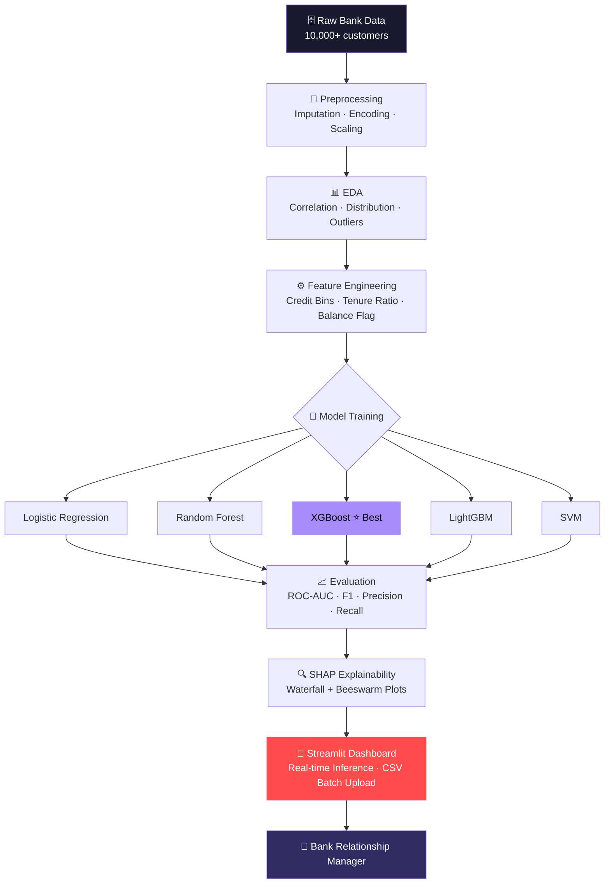

<div align="center">


[](https://git.io/typing-svg)

<br/>

[](https://www.linkedin.com/in/sahilgaund03)
[](https://github.com/sahil-gaund03)
[](https://sahilgaund0310.netlify.app/)
[](https://github.com/sahil-gaund03)

</div>

---

## 🗂️ Repository Overview

> **This repository is a curated archive of Sahil Gaund's professional journey** — housing ML/Data Science projects, industry certifications, IBM badges, virtual internship completions, an AI Engineer learning roadmap, and a full resume. It serves as a single source of truth for recruiters, collaborators, and the open-source community.

```
📌 Not just a portfolio — a living record of growth from student to AI/ML practitioner.
```

---

## 👤 About Me


```python
class SahilGaund:
    title       = "AI / ML Engineer | Data Scientist"
    location    = "India 🇮🇳  ·  Open to Remote"
    focus       = "End-to-end ML: raw data → production inference"
    languages   = ["Python", "SQL", "C++"]
    interests   = [
        "Machine Learning", "NLP",
        "Computer Vision", "Explainable AI"
    ]
    flagship    = "Bank Customer Churn Prediction (87% accuracy)"
    open_to     = ["Internships", "Collaborations", "Research"]
    fun_fact    = "🥉 Award-winning photographer → data scientist"
```

<br/>

- 🎯 &nbsp;Designing **production-grade ML pipelines** with measurable impact  
- 📊 &nbsp;Deep expertise in **predictive modeling**, **NLP**, and **dashboarding**  
- 🔍 &nbsp;Committed to **SHAP-driven model explainability** in every project  
- 🏆 &nbsp;**87% accuracy** on churn prediction — best model: XGBoost  
- 📸 &nbsp;**3rd Prize** — University Photography Competition (200+ participants)  
- 📬 &nbsp;Response within **24 hours** — always open to a conversation  

<br clear="right"/>

---

## 📁 Repository Structure

```
📦 achivement/
│
├── 📂 ALL Projects/                          # Data Science & ML project reports
│   ├── 📂 Bank Customer Churn Prediction/    # Flagship project — XGBoost · SHAP · Streamlit
│   ├── 📂 CARE TRANSITION ANALYTICS - EDA/   # Healthcare EDA with Streamlit deployment
│   ├── 📂 Dashboard/                         # Interactive customer analytics dashboard (HTML)
│   ├── 📄 SMS Spam Detection.pdf
│   ├── 📄 Email Spam Classifier Project.pdf
│   ├── 📄 Netflix Data Analysis.pdf
│   ├── 📄 Diwali Sales Analysis.pdf
│   ├── 📄 Google Search Analysis.pdf
│   ├── 📄 Coaster Name EDA.pdf
│   ├── 📄 Website Data Analysis.pdf
│   ├── 📄 Churn Prediction.pdf
│   ├── 📄 ML Algorithms.pdf
│   └── 📄 Python Data Analysis.pdf
│
├── 📂 CERTIFICATE/                           # 20+ verified course completions
│   ├── Applied Data Science with Python.pdf
│   ├── Fundamentals of ML and AI.pdf
│   ├── Machine Learning with Python.pdf
│   ├── Introduction to Generative AI.pdf
│   ├── Introduction to Large Language Models.pdf
│   ├── Create Image Captioning Models.pdf
│   ├── Data Visualization with Python.pdf
│   ├── AWS Foundations — ML Basics.pdf
│   ├── Google Analytics Certification.pdf
│   ├── Innovating with Google Cloud AI.pdf
│   ├── Databricks for Machine Learning.pdf
│   ├── AI And ML Full Course.pdf
│   ├── Prompt Engineering with GitHub Copilot.pdf
│   └── ...and more
│
├── 📂 IBM Badges/                            # Verified IBM digital credentials
│   ├── Python for Data Science.pdf
│   ├── Data Analysis Using Python.pdf
│   ├── Data Visualization Using Python.pdf
│   ├── Machine Learning with Python — Level 1.pdf
│   └── Applied Data Science with Python — Level 2.pdf
│
├── 📂 Virtual Internship/                    # Forage job simulation certificates
│   ├── Data Analytics Job Simulation.pdf
│   ├── Tata GenAI Powered Data Analytics.pdf
│   └── Introduction to Software Engineering Job.pdf
│
├── 📂 Internship/                            # Real-world internship documentation
│   ├── OfferLetter.pdf
│   └── Internship Completion Evidence
│
├── 📂 AI Engineer Roadmap/                   # Curated 12-month learning plan
│   ├── AI Engineer 12 Months Roadmap.pdf
│   ├── Free AI ML Courses.pdf
│   └── AI.jpeg
│
├── 📂 RESUME/
│   └── Sahil Gaund Resume.pdf                # Latest CV — download-ready
│
└── 📄 README.md
```

---

## 🚀 Featured Project — Bank Customer Churn Prediction

<div align="center">

[](https://github.com/sahil-gaund03/churn-prediction)
[](https://churn-prediction.streamlit.app)
[](https://colab.research.google.com/)

</div>

### 📌 Problem Statement

> Banks lose **15–25% of customers annually** to churn, costing millions in replacement acquisition.  
> Most internal tools use lagging indicators — they react after the customer has already left.  
>
> **Goal:** A real-time, interpretable ML system that flags at-risk customers early, deployable by non-technical bank staff with full SHAP explainability.

---

### 🏗️ System Architecture



---

### 🔬 ML Methodology

| Phase | Actions | Tools |
|:---|:---|:---|
| **Data Wrangling** | Missing value imputation, outlier detection, type casting | `Pandas`, `NumPy` |
| **EDA** | Churn rate by geography, age, balance distribution | `Matplotlib`, `Seaborn` |
| **Feature Engineering** | Credit score bins, balance-to-salary ratio, activity flags | `Pandas`, `Scikit-learn` |
| **Modeling** | 5 algorithms trained, k=5 cross-validation | `Scikit-learn`, `XGBoost`, `LightGBM` |
| **Explainability** | SHAP waterfall + beeswarm plots per prediction | `SHAP` |
| **Deployment** | Interactive web app with CSV batch inference | `Streamlit` |

---

### 📊 Model Performance Metrics

<div align="center">

| Model | Accuracy | ROC-AUC | F1-Score | Precision | Recall |
|:---:|:---:|:---:|:---:|:---:|:---:|
| Logistic Regression | 81.2% | 0.774 | 0.76 | 0.79 | 0.73 |
| Random Forest | 84.6% | 0.842 | 0.83 | 0.86 | 0.80 |
| SVM | 82.1% | 0.798 | 0.79 | 0.81 | 0.77 |
| LightGBM | 85.9% | 0.861 | 0.84 | 0.87 | 0.82 |
| **XGBoost ⭐** | **87.3%** | **0.891** | **0.86** | **0.89** | **0.84** |

</div>

**Key SHAP Insights:**

- `Age` and `NumOfProducts` were the **strongest churn predictors** globally
- Customers in **Germany** showed **2.5× higher** churn propensity vs. France and Spain
- Inactive members with `Balance > $100K` had a **68% churn probability**
- Binary flag `IsActiveMember` had outsized impact in borderline cases

---

## 📋 All Projects Overview

| # | Project | Type | Tools | Highlights |
|:--:|:---|:---:|:---|:---|
| 1 | **Bank Customer Churn Prediction** | Classification | XGBoost, SHAP, Streamlit | 87% accuracy, full explainability |
| 2 | **Care Transition Analytics EDA** | EDA + Deployment | Pandas, Seaborn, Streamlit | Healthcare domain, deployed app |
| 3 | **SMS Spam Detection** | NLP Classification | Scikit-learn, NLTK | TF-IDF + Naive Bayes pipeline |
| 4 | **Email Spam Classifier** | NLP Classification | Python, ML | End-to-end classifier |
| 5 | **Netflix Data Analysis** | EDA | Pandas, Matplotlib | Trend & content analysis |
| 6 | **Diwali Sales Analysis** | EDA | Pandas, Seaborn | Consumer behavior insights |
| 7 | **Google Search Analysis** | EDA | Python, Plotly | Query trend analysis |
| 8 | **Customer Analytics Dashboard** | Visualization | HTML, JS | Interactive, browser-native dashboard |
| 9 | **Coaster Name EDA** | EDA | Pandas | Thematic naming pattern analysis |
| 10 | **Website Data Analysis** | Analytics | Python | Traffic & engagement analytics |

---

## 🛠️ Tech Stack

<div align="center">

**Core Languages**

[](https://skillicons.dev)

**ML / Data Science**

[](https://skillicons.dev)

**Deployment & Tools**

[](https://skillicons.dev)

**Databases**

[](https://skillicons.dev)

</div>

| Domain | Technologies |
|:---|:---|
| **ML Frameworks** | Scikit-learn · XGBoost · LightGBM · TensorFlow · PyTorch |
| **Data & EDA** | Pandas · NumPy · Matplotlib · Seaborn · Plotly |
| **Explainability** | SHAP · LIME · Permutation Importance |
| **NLP** | HuggingFace Transformers · NLTK · spaCy · TF-IDF |
| **Computer Vision** | OpenCV · YOLOv8 |
| **Deployment** | Streamlit · FastAPI · Docker |
| **DevOps & Version Control** | Git · GitHub Actions · Linux |
| **Cloud & Platforms** | AWS · Google Cloud · Databricks |

---

## 📜 Certifications

<details>
<summary><b>🔽 View All 20+ Certifications</b></summary>

<br/>

| Certificate | Issuer | Domain |
|:---|:---:|:---:|
| Applied Data Science with Python | IBM / Coursera | Data Science |
| Machine Learning with Python | IBM / Coursera | ML |
| Fundamentals of ML and AI | — | ML / AI |
| AI and ML Full Course | Simplilearn | ML / AI |
| Introduction to Generative AI | Google | GenAI |
| Introduction to Large Language Models | Google | LLMs |
| Introduction to Large Language Models | IBM | LLMs |
| Create Image Captioning Models | — | Computer Vision |
| Data Analysis with Python | IBM | Data Analysis |
| Data Visualization with Python | IBM | Visualization |
| Python 101 for Data Science | IBM | Python |
| Python Data Analysis | — | Python |
| Practicing TDD with Python | — | Software Engineering |
| Learning C++ | LinkedIn Learning | C++ |
| AWS Foundations: ML Basics | AWS | Cloud ML |
| Get Started with Databricks for ML | Databricks | ML Ops |
| Google Analytics Certification | Google | Analytics |
| Innovating with Google Cloud AI | Google Cloud | AI / Cloud |
| Introduction to Prompt Engineering | GitHub Copilot | LLMs / Dev Tools |
| HP LIFE — AI for Beginners | HP | AI |
| YUVA AI for All | — | AI Literacy |

</details>

---

## 🏅 IBM Digital Badges

<div align="center">

| Badge | Level |
|:---|:---:|
| Python for Data Science | Foundation |
| Data Analysis Using Python | Foundation |
| Data Visualization Using Python | Foundation |
| Machine Learning with Python | Level 1 |
| Applied Data Science with Python | Level 2 |

> IBM badges are blockchain-verified credentials, shareable via Credly.

</div>

---

## 💼 Internships & Simulations

| Program | Organization | Type | Domain |
|:---|:---:|:---:|:---:|
| Data Analytics Job Simulation | Forage | Virtual | Analytics |
| Tata GenAI Powered Data Analytics | Tata / Forage | Virtual | GenAI · Analytics |
| Introduction to Software Engineering | Forage | Virtual | SWE |
| Industry Internship | — | Real-world | ML / Data |

---

## 🏆 Achievements Snapshot

| | Achievement | Details |
|:---:|:---|:---|
| 🧠 | **87% Churn Prediction Accuracy** | XGBoost with end-to-end SHAP explainability |
| 📊 | **10+ Data Science Projects** | Spanning NLP, EDA, Classification, Visualization |
| 📜 | **20+ Certifications** | IBM, Google, AWS, Databricks, Coursera |
| 🏅 | **5 IBM Digital Badges** | Blockchain-verified, Credly-shareable |
| 💼 | **3 Virtual Internships** | Forage — Analytics, GenAI, Engineering |
| 📸 | **3rd Prize — Photography** | University Cultural Festival · 200+ participants |

---

## 🗺️ AI Engineer Roadmap

This repository includes a curated **12-Month AI Engineer Roadmap** and a handpicked list of **Free AI/ML Courses** — compiled for learners who want a structured path from beginner to job-ready.

```
📂 AI Engineer Roadmap/
├── AI Engineer 12 Months Roadmap.pdf    ← Month-by-month structured plan
├── Free AI ML Courses.pdf               ← Curated free resource list
└── AI.jpeg                              ← Visual roadmap overview
```

---

## 📈 GitHub Analytics

<div align="center">


&nbsp;&nbsp;


<br/><br/>


</div>

---

## ⚡ Core Competencies

| Competency | Description |
|:---|:---|
| 🔬 **ML Engineering** | Full pipeline design: ingestion → feature store → training → serving |
| 📊 **Statistical Analysis** | Hypothesis testing, A/B testing, distribution modeling |
| 🧾 **Explainability** | SHAP, LIME, permutation importance — production-ready interpretability |
| 🚀 **Rapid Prototyping** | MVP to deployed app in days using Streamlit + FastAPI |
| 🧠 **Cross-domain Thinking** | Translating business KPIs directly into ML objectives |
| 🔍 **EDA Mastery** | Surfacing non-obvious patterns from messy, real-world datasets |

---

## 🤝 Contributing

This is primarily a personal portfolio repository. However, contributions are welcome in the following forms:

1. **Feedback** — Open an issue with suggestions to improve documentation or project reports
2. **Collaboration** — If you'd like to collaborate on an ML or Data Science project, reach out via LinkedIn
3. **Resources** — If you know of a high-quality free course or roadmap resource worth adding, open a pull request

```bash
# Fork the repo
git clone https://github.com/sahil-gaund03/achivement.git

# Create your branch
git checkout -b feature/your-suggestion

# Commit your changes
git commit -m "Add: your meaningful change"

# Push and open a Pull Request
git push origin feature/your-suggestion
```

> Please keep all contributions respectful, relevant, and well-documented.

---

## 📄 License

This repository is licensed under the **MIT License**.  
You are free to reference, adapt, or build upon this work — attribution appreciated but not required.

[](https://opensource.org/licenses/MIT)

---

## 👤 Author

<div align="center">


### **Sahil Gaund**
*AI / ML Engineer · Data Scientist · Open to Opportunities*

[](https://www.linkedin.com/in/sahilgaund03)
[](https://github.com/sahil-gaund03)
[](https://sahilgaund0310.netlify.app/)

</div>

---

## ⭐ Support

If this repository has been useful — whether you borrowed an idea, used the roadmap, or found the project docs helpful — consider leaving a ⭐ star. It helps others discover this work and keeps me motivated to keep building in public.

<div align="center">

[](https://github.com/sahil-gaund03/achivement)
&nbsp;&nbsp;
[](https://github.com/sahil-gaund03)

</div>

---

<div align="center">


**Sahil Gaund** · AI/ML Engineer · Based in India

*"Data is the new oil. Refined intelligently, it powers everything."*


</div>
